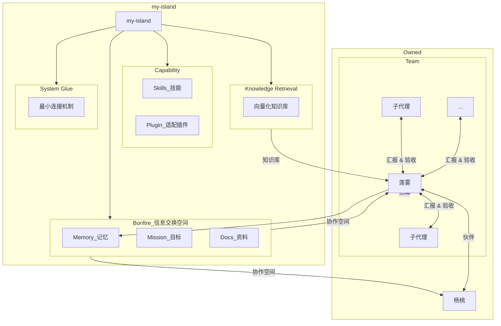

# my-island SPEC

## 1. Definition

`my-island` 是一个面向 human 与 agent 协作的本地优先生态系统。

它当前的核心目标只有两个：

- 提供一个可沉淀、可继承、可回查的知识空间
- 提供一个可组织、可分工、可推进任务的协作空间

当前我们主要在规划 `bonfire` 的蓝图与建设方式，但 `bonfire` 只是 `my-island` 里的一个信息交换空间，不是系统本体，也不是唯一能力中心。

## 2. Design Goals

- 本地优先，避免把核心工作流建立在外部平台之上
- 让 human 与 agent 在同一套对象模型上协作
- 保持系统克制，避免为了治理而扩张治理
- 让知识沉淀与任务推进都可以持续积累
- 用更长远的视角规划当前设施，避免局部最优反噬未来演化
- 保留未来扩展空间，但不提前写死未落地能力

## 3. Core Spaces

### 3.1 Knowledge Space

知识空间负责承载长期保留、可复用、可被继承或回查的内容。

当前主要对象：

- `memory`
- `decision`
- `summary`
- `refs`

### 3.2 Collaboration Space

协作空间负责围绕具体目标组织工作。

当前主要对象：

- `mission`
- `team/<member>/plan.md`
- `team/<member>/report.md`
- `team/<member>/notes.md`

## 4. bonfire

`bonfire` 是 `my-island` 当前使用的信息交换空间。

在当前阶段，最好的交换媒介是本地文档，所以 `bonfire` 具有较强的文档设计特征。

它负责：

- 承载文档型对象的真实实例
- 提供当前主线所需的 mission / memory / docs / refs / runtime 落点
- 为 agent 提供 `memory` 这一“复活点”机制的落地空间

它不负责：

- 代表整个 `my-island`
- 成为所有系统能力的中心
- 承载所有未来能力的定义与边界

说明：

- 当前把 `decision`、`summary`、`refs` 放在 `bonfire` 中，是出于专注与文档就近原则的可控选择
- 这不代表这些对象在长期演化中必然都以 `bonfire` 为唯一归属中心

当前规范路径：`~/.local/share/bonfire`

## 5. Core Object Model

### 5.1 mission

`mission` 是围绕具体目标建立的治理与上下文容器。

它不是 task board，也不是 release board。

主生命周期：

```text
draft -> active -> closed
```

附加标记：

- `deprecated`

### 5.2 memory

`memory` 是默认继承经验层。

它只收：

- 跨 mission 仍然成立的经验
- 以后默认值得继承的稳定原则

它不收：

- 单次过程
- 当前上下文
- 未确认方案

### 5.3 decision

`decision` 用于固定已经确认、长期有效的关键判断。

### 5.4 summary

`summary` 用于沉淀某一轮讨论或某一阶段收敛了什么。

### 5.5 team / member

- `team` 是 mission 下的执行层
- `team/<member>/` 承载成员执行材料
- 顶层 `members/` 只承载成员档案与成员级默认规则

## 6. Object Boundaries

### 6.1 memory / decision / summary

- `memory`：以后默认该继承的经验
- `decision`：已经确认、长期有效的关键判断
- `summary`：某一轮讨论或某一阶段收敛了什么

### 6.2 mission / team

- `mission`：目标的治理与上下文
- `team`：成员执行层
- 详细执行计划不回灌到 `mission`

## 7. Identity and Metadata

正式对象使用 frontmatter。

规则：

- `id` 使用稳定 UUID
- 文件名继续保留 `timestamp + slug`
- 文件名允许调整，`id` 不应随之改变
- 结构化时间字段统一使用 `ISO 8601`

## 8. Default Reading Order

默认继承遵循 `memory-first`：

```text
memory
  -> mission
  -> docs / refs
```

含义：

- agent 默认先读 `memory`
- 当前工作明确挂在某条 `mission` 上时，再读对应 `mission`
- 只有在 `memory` 与 `mission` 都不足时，再按需展开到 `docs/` 与 `refs/`

## 9. Development Entry

正式开发的最小前提：

- 对应的 `mission` 已经存在
- 当前工作默认发生在该 `mission` 上下文中

当前开发流程：

```text
mission 已存在
  -> human 决定开始开发
  -> Prometheus 输出单一总计划
  -> human 审核总计划
  -> main agent 拆解与分配
  -> human 创建对应数量的 worktree
  -> 初始化 worktree / 合成 AGENTS
  -> members 开始执行
```

## 10. Allocation Principles

成员拆分遵循：

- `Prometheus` 只输出一个总计划
- `main agent` 负责把总计划拆成成员可执行计划
- 拆分时优先保持模块完整性
- 不把强依赖改动拆给多个成员
- 不为了提高并行度而把任务切得过碎
- 团队成员数量默认上限为 6

进一步判断规则：

- 能由 1 人完整做完的模块，不为了并行硬拆成多人
- 只有当模块边界清楚、contract 稳定、可以独立验收时，才适合拆给不同成员
- 如果拆分后需要频繁同步、频繁改同一批文件，说明已经拆过头

## 11. Knowledge Promotion

`mission -> memory` 采用轻量提升路径：

```text
mission
  -> candidate
  -> main agent proposal
  -> human confirm
  -> memory
```

当前约定：

- `Suggested Promotions` 固定放在执行侧 `report.md`
- `mission.md` 先不强制保留该 section

## 12. Current Deferred Topics

以下内容属于已知规划，但当前不写入强规则：

- `daily`
- knowledge retrieval layer 的具体设计（embedding / vector DB）
- capability layer 的具体接入方式（skills / MCP / plugins）
- worktree 初始化的自动化程度
- system glue 的最小职责与实现方式

当前对 system glue 的理解是：

- 它是连接文档空间、能力层与执行环境的最小连接机制
- 它不应长成重量级编排系统
- 在当前阶段，只需要为未来预留位置，不急于实现

## 13. Architecture


