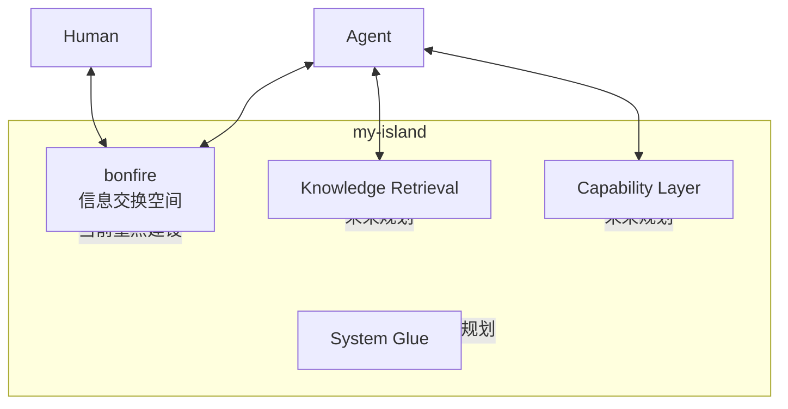

# my-island SPEC

## Definition

`my-island` 是一个面向 human 与 agent 协作的本地优先生态系统。

它的核心目标不是堆叠工具，而是为使用者提供两类基础空间：

- 知识空间：可沉淀、可继承、可回查
- 协作空间：可组织、可分工、可推进任务

当前我们主要在规划与建设 `bonfire`，但 `bonfire` 只是 `my-island` 中的一块设施，不是系统本体，也不是唯一能力中心。

## Problem

当前常见的人机协作环境有几个根本问题：

- 核心信息分散在聊天、笔记、项目目录与第三方平台之间
- agent 很难稳定继承长期经验
- 多成员协作缺少长期可沉淀的交换空间
- 系统很容易为了治理而扩张成新的负担

`my-island` 试图解决的，不只是记录问题，而是为长期协作建立一个可以持续扩建的私人生态。

## Goal

`my-island` 的目标是让 human 与 agent 拥有一个长期可演化的私人岛屿空间，用来：

- 发起与推进任务
- 组织队友与协作
- 保留阶段结果与长期经验
- 在未来逐步接入更多能力，而不破坏当前基础设施

## Principles

- 本地优先
- 长期视角优先于局部便利
- 克制设计，避免过早引入复杂机制
- 文档与知识分层
- 协作与沉淀并重
- 当前决策要为未来演化留白

## Ecosystem View

`my-island` 不是单一目录，也不是单一工具，而是一个持续建设中的生态系统。

当前可以明确分成几类设施：

- 信息交换空间
- 知识检索能力
- 能力扩展层
- 最小连接机制

这些设施会逐步建设，但不要求在当前阶段同时落地。

## Current Focus: bonfire

`bonfire` 是 `my-island` 当前重点建设的设施。

它的主要作用是：

- 作为信息交换空间
- 承载文档型对象的真实实例
- 为 agent 提供 `memory` 这一复活点机制的落地空间

由于当前最有效的信息交换媒介是本地文档，`bonfire` 具有较强的文档设计特征。这是当前阶段的合理选择，但不意味着整个 `my-island` 将永远以 `bonfire` 为中心组织。

当前规范路径：`~/.local/share/bonfire`

## bonfire Boundaries

`bonfire` 当前负责：

- 承载 mission、memory、decision、summary、refs 等文档型对象
- 作为 human 与 agents 的主要交换空间
- 保存当前阶段需要持续回看的文档资料

`bonfire` 当前不负责：

- 代表整个 `my-island`
- 成为所有未来能力的唯一中心
- 定义整个生态系统的全部能力边界

## Future Capability Map

除 `bonfire` 之外，`my-island` 未来还可能逐步建设：

- Knowledge Retrieval Layer
  - 例如 embedding、vector DB、语义检索
- Capability Layer
  - 例如 skills、MCP、plugins、adapters
- System Glue
  - 连接文档空间、能力层与执行环境的最小连接机制

这些都是生态系统规划的一部分，但当前不作为强规则写死。

## Non-Goals

当前阶段，`my-island` 不以这些为目标：

- 构建重量级编排系统
- 先设计完整的自动化治理机制
- 在 `bonfire` 中承载所有未来能力
- 用复杂基础设施替代真实协作需求

## Open Questions

以下问题已经进入规划视野，但仍保持开放：

- `daily` 是否保留，以及如何定位
- knowledge retrieval layer 的具体设计
- capability layer 的具体接入方式
- system glue 的最小职责与实现方式
- 规则如何可靠进入真实执行上下文

## Architecture

